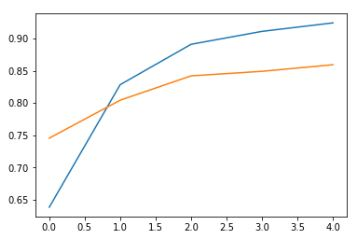

# Tensorflow Data Pipeline
- In this project, i explore tensorflow data pipeline by accomplishing three tasks concerned with building data generators, image augmentation, and dataset generation and training.
- You can get the code in [tensorflow_data_pipeline.ipynb](./tensorflow_data_pipeline.ipynb)

## Data Generators
- I implemented a simple training and validation data generator and used it with `model.fit_generator` and `model.predict_generator` using the fertility dataset.
- I preprocessed the data by using `pd.get_dummies` to convert Season to One Hot Encoding and also Output column to numeric values.

## Image Augmentation
- I used `ImageDataGenerator` from `tensorflow.keras.preprocessing.image` to convert images to monochrome (grayscale), augment the images by rotating in a range of 180 degrees and rescale them by 1/255.
- I trained a simple model with the image data generator and cifar10 dataset.

## Using the Dataset Class for Converting tensors to Datasets and Training models
- I made a simple dataset from numpy arrays and text files using shakespeare texts with `TextLineDataset` from `tf.data`.
- I implemented a simple dataset from a pandas dataframe of a bank's data and trained model for binary classification.

# Setup
- Create virtual environment:  `python -m venv venv`
- Activate virtual environment: `call venv/Scripts/activate.bat` in cmd
- Install dependencies: `pip install -r requirements.txt`

# Libraries
- Tensorflow
- Numpy
- Pandas
- scikit-learn
- ipykernel

## Contact
 - LinkedIn: [Natan Asrat](https://linkedin.com/in/natan-asrat)
 - Gmail: nathanyilmaasrat@gmail.com
 - Telegram: [Natan Asrat](https://t.me/fail_your_way_to_success)
 - Youtube: [Natville](https://www.youtube.com/@natvilletutor)

